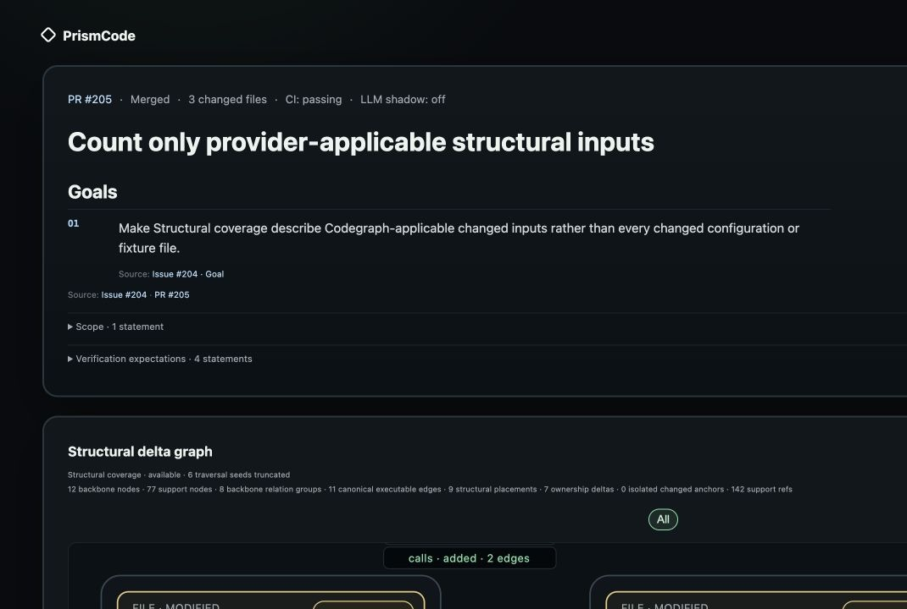
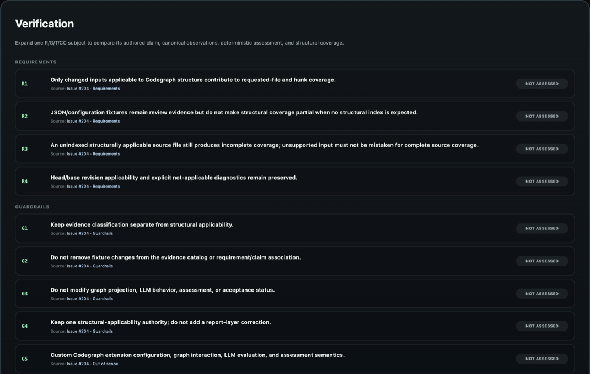
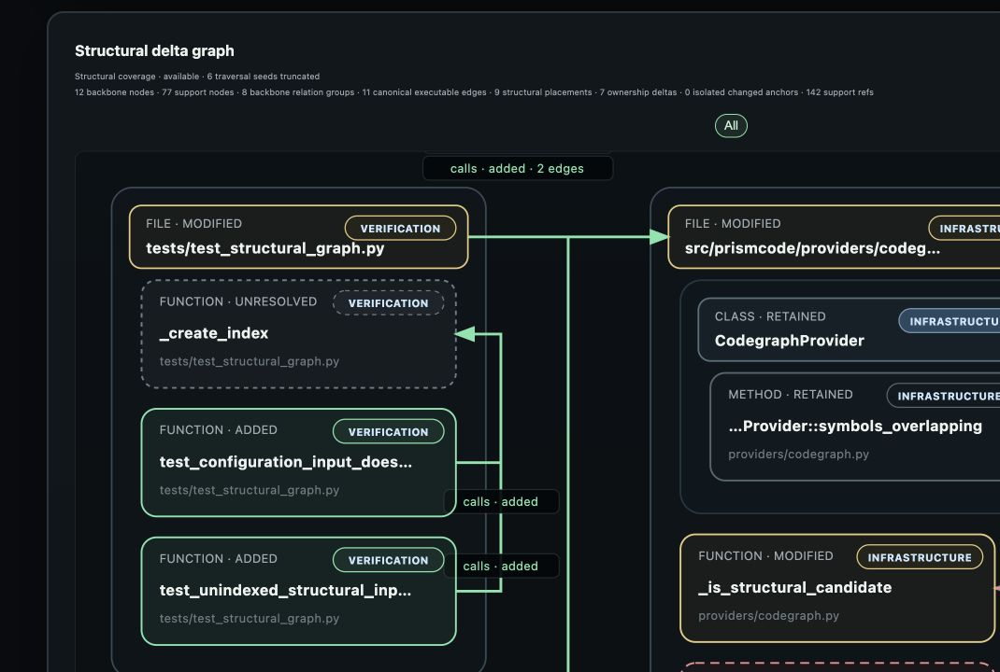

# PrismCode

PrismCode turns a pull request into an interactive visual map of what changed
across the repository—and helps reviewers judge whether the implementation
matches its acceptance criteria.

It sits after a human or coding agent has written code and opened a PR:

```text
Human or coding agent
        ↓ writes code
Pull request + linked Issue + CI
        ↓ prismcode review
Interactive HTML review brief
        ↓ inspect evidence and gaps
Human review decision
```

PrismCode does not write the change or approve it. It connects the PR's authored
requirements and transformation claims to the code, structural relationships,
and current-head checks a reviewer can actually inspect.



PrismCode carries Issue objectives (`O`), requirements (`R`), and guardrails
(`G`) into source-linked review rows alongside PR-authored transformation
claims.



Expanding a row shows its observations and assessment and focuses the graph
below. The animation alternates between **All** and **R4**: graph membership
stays fixed while the associated structure is highlighted.



PrismCode also carries PR-authored transformation claims (`T`) and completion
conditions (`CC`) into the same inspection flow. When a claim names a concrete
file or symbol in a Markdown code span, selecting it focuses the associated
code and relationships. Selector-free or unmatched prose stays visible without
an invented graph mapping, so a reviewer can distinguish a coding agent's
claim from the structure that actually changed. See the
[authoring guide](docs/pull-request-guidelines.md).

## Quick start

Live structure-aware reviews require Git and either the external
[Codegraph](https://github.com/colbymchenry/codegraph) CLI or Node.js with
`npx`. Install PrismCode once from its source checkout:

```bash
python -m venv .venv
source .venv/bin/activate
pip install .
```

Then review a PR from any directory; no checkout of the target repository is
required:

```bash
prismcode review --repo owner/repository --pr 123 --output report.html
```

Open `report.html` in a browser. PrismCode reads `GITHUB_TOKEN` when it is set,
otherwise tries the authenticated `gh` CLI for the configured GitHub host;
public repositories can also use GitHub's unauthenticated limits.

## Review a GitHub pull request

`--repo` reads live PR, linked-Issue, patch, and check data from GitHub. By
default PrismCode also fetches the exact PR base and head revisions into a
private temporary workspace, so the command can run from any directory:

```bash
prismcode review --repo owner/repository --pr 123 --output build/pr-123.html
```

If a local repository already contains both revisions, use it as an explicit
optimization:

```bash
prismcode review \
  --repo owner/repository \
  --pr 123 \
  --repo-root /path/to/local/repository \
  --output build/pr-123.html
```

PrismCode verifies the fetched revisions against GitHub metadata, creates
private worktrees and separate Codegraph indexes, then removes every owned Git
source, worktree, and index after success or failure. Credentials remain
process-scoped and never enter the Git URL, command arguments, report, or
persisted repository configuration. `--no-structural-graph` is Codegraph-free
and fetches only the exact head required by deterministic repository scans.

Private repositories use the same `GITHUB_TOKEN` or authenticated `gh`
credentials; do not put a token in the command or repository URL. For GitHub
Enterprise Server, name both the API endpoint and the host explicitly trusted
to receive those credentials:

```bash
prismcode review \
  --repo team/project \
  --pr 123 \
  --github-api-url https://github.company.com/api/v3 \
  --trusted-github-api-host github.company.com \
  --output report.html
```

The trust option must match the HTTPS API host. PrismCode refuses to send a
token to any other custom host, which protects credentials from an accidental
or malicious API URL.

For a network-free smoke test instead:

```bash
prismcode review --fixture fixtures/pr574.json --output build/pr574.html
```

See [Usage](docs/usage.md) for authentication, structural analysis, CI
integration, diagnostics, and advanced commands.

## Add it to the PR workflow

The included [PrismCode review workflow](.github/workflows/review.yml) runs on
pull requests and can also be started manually for a target repository and PR.
Each run places the report link in the job summary and retains the HTML as a
GitHub Actions artifact.

The intended loop is simple:

1. A human or coding agent opens or updates a PR.
2. CI runs PrismCode against that PR revision.
3. The reviewer opens one report and inspects the requirement-to-evidence path,
   structural change, checks, and unresolved coverage.
4. The PR is revised or reviewed using those observations; PrismCode itself
   does not make the merge decision.

## Deterministic core, optional LLM research

The complete supported product works without an LLM. A normal
`prismcode review` run sends no repository content to a model provider;
canonical diff facts, symbols, structural graphs, evidence routing,
assessment, and HTML conclusions remain deterministic.

PrismCode is also exploring where an LLM can add semantic flexibility without
becoming an ungrounded review authority:

| Area | Status | Role |
| --- | --- | --- |
| Full review generation | Supported, deterministic | Produces the complete interactive report and every formal conclusion without a model. |
| Candidate evidence interpretation | Experimental ✓ | In an opt-in shadow run, the LLM classifies bounded deterministic candidates as selected, rejected, or insufficient and labels their evidence relationship and semantic role. |
| LLM-assisted semantic intake and R/G-to-subgraph mapping | To explore | Test whether a model can understand less structured Issue language and improve requirement-to-code retrieval. |
| Architectural overlays and grounded explanations | To explore | Test model-assisted higher-level views and explanations while preserving source links, uncertainty, and deterministic authority. |

The shadow result never changes the formal report, assessment, or merge
decision. It is evaluated separately against deterministic selection and
frozen human labels. See [LLM shadow evaluation](docs/llm-shadow.md) for the
commands and safety boundary; current and planned experiments are tracked in
[#211](https://github.com/prismcode-ai/prismcode/issues/211),
[#224](https://github.com/prismcode-ai/prismcode/issues/224),
[#225](https://github.com/prismcode-ai/prismcode/issues/225),
[#226](https://github.com/prismcode-ai/prismcode/issues/226), and
[#227](https://github.com/prismcode-ai/prismcode/issues/227).

## Documentation

- [Usage](docs/usage.md) — local, GitHub, and Actions workflows
- [Architecture](docs/architecture.md) — canonical stages, ownership, and
  dependency direction
- [Review retrieval design](docs/review-retrieval-design.md) — evidence and
  structural retrieval contracts
- [Evaluation](docs/evaluation.md) — offline suites, metrics, and gates
- [Provenance](docs/provenance.md) — source and evidence identity
- [Fixture schema](docs/fixture-schema.md) — offline input format
- [Issue authoring](docs/issue-guidelines.md) and
  [PR authoring](docs/pull-request-guidelines.md) — source contracts for
  requirements and change claims
- [Agent change protocol](docs/agent-change-protocol.md) — the repository's
  responsibility-closed coding method

## Security

PrismCode runs locally: temporary source fetches and base/head worktrees,
Codegraph indexes, deterministic analysis, and final HTML stay on the machine
or CI runner where the command executes. A live review calls the configured
GitHub API and Git host to collect PR metadata and the exact reviewed source;
the optional LLM shadow path is the only mode that sends bounded review content
to a model provider.

Tokens are read from environment variables or the authenticated `gh` CLI and
are not stored in Git URLs, persisted Git configuration, review metadata, or
generated HTML. Generated reports create hyperlinks only for absolute HTTP and
HTTPS URLs. Official GitHub is trusted by default; a custom GitHub API host
must be named explicitly before PrismCode will send it a token.

## Build the next layer with us

Change understanding is only the first step. PrismCode is also an open
experiment in making coding agents maintainable and extensible enough to work
on production code: every change is used to test and refine the repository's
own method, not only its report generator.

That connection is visible in every report: Issue-authored objectives,
requirements, and guardrails (`O/R/G`) describe what the change must achieve,
while PR-authored transformation claims and completion conditions (`T/CC`)
describe what the human or coding agent says it changed. PrismCode places both
against the observed diff and structural graph, making mismatches, missing
evidence, and unresolved coverage inspectable instead of trusting the PR
description as proof.

That method starts in [AGENTS.md](AGENTS.md) and is made operational by four
guides: [Issue authoring](docs/issue-guidelines.md), the
[agent change protocol](docs/agent-change-protocol.md),
[commit messages](docs/commit-message-guidelines.md), and
[pull requests](docs/pull-request-guidelines.md). They define how requirements,
responsibility boundaries, implementation transitions, verification, and
post-change learning stay connected.

Contributions and competing approaches are welcome. You can improve an
existing adapter, help design [requirement sources beyond GitHub Issues](https://github.com/prismcode-ai/prismcode/issues/233)
such as Jira, add an evaluation case, or challenge the coding method with a
concrete counterexample. Start with the
[open Issues](https://github.com/prismcode-ai/prismcode/issues) or open a
focused Issue using the repository's authoring guide.

## License

PrismCode is licensed under the [MIT License](LICENSE).
